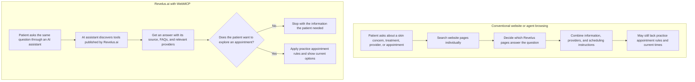
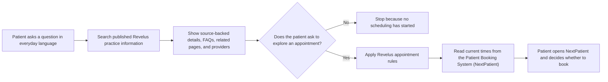
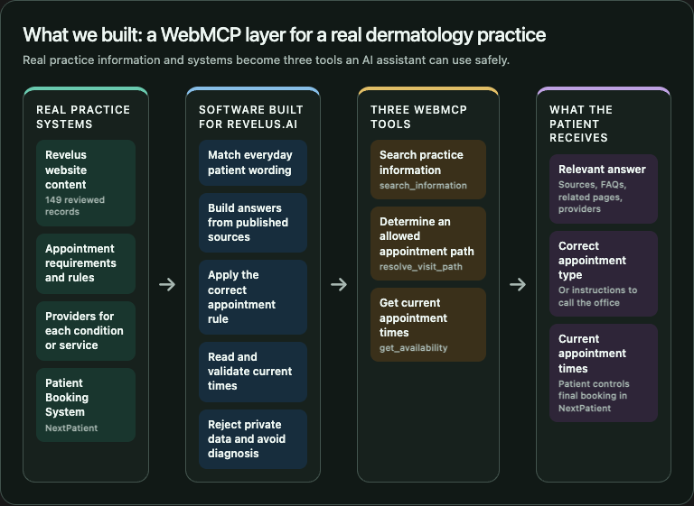
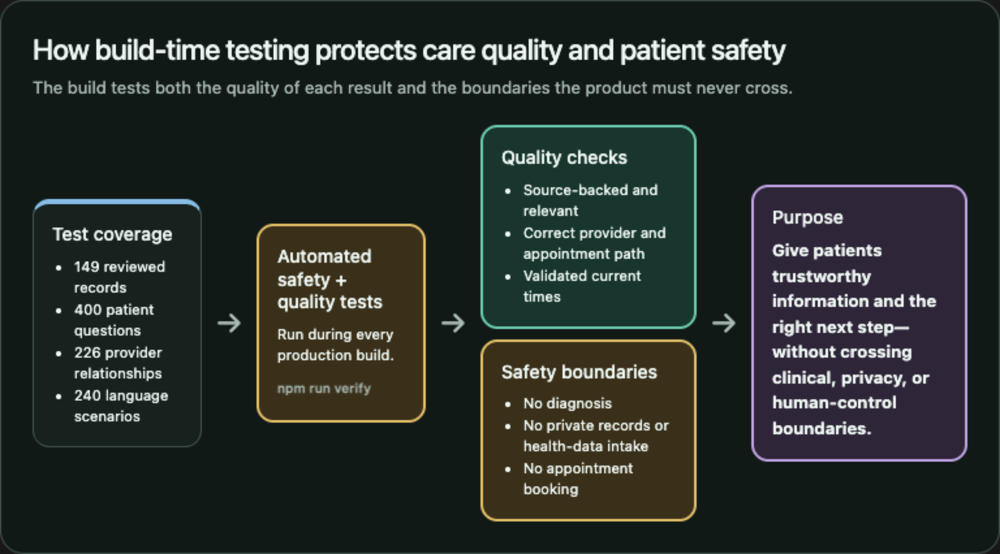
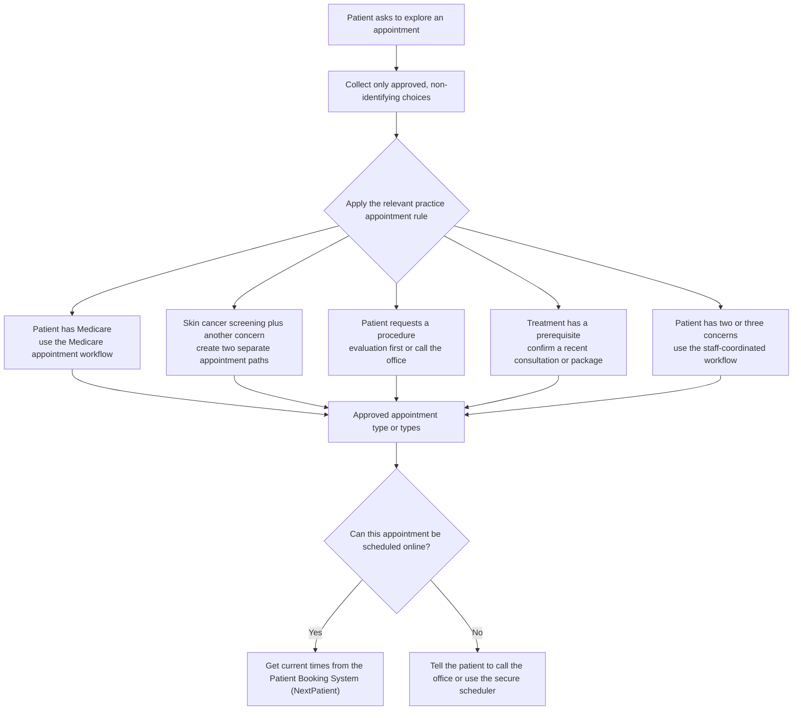

# Ask Revelus — WebMCP Challenge


[](LICENSE)


Ask Revelus is a page-local WebMCP experience that turns a dermatology
practice's published information and scheduling rules into structured tools for
people and AI assistants. It can search reviewed content, return a canonical
answer with its source, resolve a non-diagnostic visit path, and hand the user
off to secure scheduling without collecting patient information or booking on
the user's behalf.

This is the public source repository for the **WebMCP Challenge submission**. It
is self-contained and runs from a fresh clone with a deliberately small,
synthetic dataset. The live experience at [revelus.ai](https://revelus.ai/)
uses the same general application architecture with a separate, private corpus
owned by Revelus Dermatology.

> [!IMPORTANT]
> The bundled corpus supports exactly the ten documented demo queries. It is
> not a general-purpose copy of the Revelus website. To expand coverage, bring
> a corpus you have the right to use and follow [the dataset guide](DATASET.md).

## Contents

- [What the project demonstrates](#what-the-project-demonstrates)
- [Built during the challenge](#built-during-the-challenge)
- [Try the live experience](#try-the-live-experience)
- [Quick start](#quick-start)
- [The ten supported queries](#the-ten-supported-queries)
- [WebMCP tool surface](#webmcp-tool-surface)
- [Architecture](#architecture)
- [Synthetic corpus and bring-your-own data](#synthetic-corpus-and-bring-your-own-data)
- [Project structure](#project-structure)
- [Testing and verification](#testing-and-verification)
- [Deployment](#deployment)
- [Privacy, safety, and trust boundaries](#privacy-safety-and-trust-boundaries)
- [Known limitations](#known-limitations)
- [Contributing](#contributing)
- [License](#license)

## What the project demonstrates

Most websites are designed for people to click through, but their information
and actions are difficult for an assistant to use reliably. Ask Revelus adds a
small, typed tool layer directly to the page with
`document.modelContext.registerTool(...)`.

The implementation demonstrates:

- **Page-local WebMCP tools.** Three focused tools are registered by the page and share
  the same execution layer as the visible interface.
- **Grounded retrieval.** Search results and answers are projected from a
  reviewed corpus and include canonical source URLs.
- **Patient-language resolution.** Plain-language phrases can resolve to known
  content concepts without asking the user to know the site's taxonomy.
- **Structured visit routing.** Appointment logic accepts enumerated,
  non-identifying facts and produces validated paths rather than free-form
  booking guesses.
- **Human-controlled scheduling.** Availability is read-only. A user must
  deliberately continue to the secure scheduling provider to review and
  complete any appointment.
- **One behavior for UI and assistants.** Page controls and native WebMCP calls
  invoke the same action handlers and update the same interface.
- **A visible privacy boundary.** Requests for records, identity-bearing data,
  diagnosis, or image interpretation are stopped before retrieval.

No external model API or API key is required to run this repository. A
WebMCP-enabled client decides when to invoke the registered tools; the included
page also provides controls for exercising the same handlers directly.

### Why WebMCP



### Learn, decide, and optionally act



Education is a complete outcome. Search does not silently become consent to
start a scheduling workflow.

## Built during the challenge

This submission is a meaningful WebMCP extension of a pre-existing business
website. It does **not** claim that Revelus Dermatology, its primary website, or
its underlying content and scheduling systems were created for the challenge.

The [official rules](https://webmcp.devpost.com/rules) allow a pre-existing
project when it was meaningfully extended with WebMCP after the submission
period began, provided the prior work and challenge work are clearly
distinguished. The relevant scope for this submission is:

| Predates the challenge | Built during the challenge submission period |
| --- | --- |
| Revelus Dermatology as an existing practice and brand | The standalone [Revelus.ai](https://revelus.ai/) agent-facing experience |
| The existing [revelusdermatology.com](https://revelusdermatology.com/) website and its conventional navigation | The page-local WebMCP integration and three registered tools |
| Previously published practice content, provider information, brand assets, and photography | The structured content-matching, canonical-answer, and page-card projection layers |
| Existing business rules and appointment offerings | The typed, non-diagnostic visit-path resolver and its assistant-facing contracts |
| The practice's existing NextPatient scheduling system and live appointment inventory | The read-only availability adapter, outbound-link validation, and human-controlled scheduling handoff |
| Existing secure patient communication and record systems | The privacy gate, de-identified tool inputs, patient-record refusal, safety messaging, and response inspector |

Revelus.ai and the WebMCP work in the right-hand column were developed during
the official August 25–September 3, 2026 submission period. Only that new work
is presented for challenge judging; the pre-existing items provide context and
authorized integration inputs.

Challenge-period work also included the shared UI/tool action layer, the public
synthetic-corpus generator and schemas, the ten-query executable fixture,
automated conformance tests, the allowlisted browser build, and the deployment
configuration in this repository. In other words, the pre-existing website
supplied authorized subject matter and real-world systems; the new work made
that information and workflow usable through a working WebMCP product.

### Dated implementation evidence

- The public repository's
  [initial release commit](https://github.com/revelusderm/revelus-webmcp-challenge/commit/2ad65262923b3b5f2a9b768fbbf30472aa5897bb)
  is dated September 3, 2026 and contains the complete runnable WebMCP
  implementation, synthetic corpus, tests, and deployment configuration.
- The current [commit history](https://github.com/revelusderm/revelus-webmcp-challenge/commits/main/)
  provides the public, timestamped record for the competition release.
- The WebMCP implementation is directly inspectable in
  [`src/challenge-tools.mjs`](src/challenge-tools.mjs), and its registration and
  ten-query behavior are executable through `npm run verify`.

The competition repository was intentionally published as a clean snapshot so
the proprietary production corpus and its history would not be exposed. That
privacy boundary does not remove any source code, assets, sample data, or
instructions required to run and evaluate the public submission.

## Try the live experience

- **Live application:** [https://revelus.ai/](https://revelus.ai/)
- **Public submission source:**
  [github.com/revelusderm/revelus-webmcp-challenge](https://github.com/revelusderm/revelus-webmcp-challenge)
- **Primary practice website:**
  [revelusdermatology.com](https://revelusdermatology.com/)

The live application is the production experience and has broader private data
coverage. This repository is the reproducible competition build with the
ten-query synthetic corpus described below.

## Quick start

### Requirements

- Node.js 22 or newer
- npm (included with Node.js)
- A modern browser

### Install and run

```bash
git clone https://github.com/revelusderm/revelus-webmcp-challenge.git
cd revelus-webmcp-challenge
npm ci
npm run verify
npm run serve
```

Open [http://127.0.0.1:8789/](http://127.0.0.1:8789/).

The page works in an ordinary browser through a local compatibility shim. In a
WebMCP-enabled browser or client, it uses the native `document.modelContext`
implementation. The connection label on the page identifies which mode is
active, and the built-in response inspector shows tool activity.

### Available commands

| Command | Purpose |
| --- | --- |
| `npm run serve` | Start the local app and same-origin JSON API on port `8789`. |
| `npm test` | Run the synthetic-query and WebMCP-registration tests. |
| `npm run build:sample` | Deterministically regenerate the bundled sample corpus and fixtures. |
| `npm run build:public` | Create the browser-facing `dist/` directory without publishing the data bundle. |
| `npm run verify` | Regenerate sample data, run all tests, and create a clean public build. |

## The ten supported queries

The bundled fixture is intentionally constrained. Nine queries resolve to one
of seven synthetic records; the tenth proves that a patient-record request is
refused.

| # | Demo query | Expected behavior |
| ---: | --- | --- |
| 1 | `I have an itchy patch on my elbow that keeps coming back.` | Ranks the synthetic eczema information record first. |
| 2 | `I'm in my 30s and still get breakouts. What are my options?` | Ranks the synthetic acne information record first. |
| 3 | `My hair is thinning and I'd like to talk to someone about it.` | Ranks the synthetic hair-loss information record first. |
| 4 | `I've never had a skin check. How do I book one?` | Ranks the synthetic skin-cancer-screening record first. |
| 5 | `How often should I get checked for skin cancer?` | Returns the screening record and its non-personalized guidance. |
| 6 | `I am curious about Botox but want to look natural.` | Ranks the synthetic Botox information record first. |
| 7 | `How much does Botox cost per unit?` | Returns the Botox record and directs the user to verify current pricing. |
| 8 | `Do you offer virtual visits?` | Ranks the synthetic virtual-visits record first. |
| 9 | `What insurance do you accept?` | Returns the insurance record and directs the user to verify current participation. |
| 10 | `Can you look up my biopsy result?` | Refuses the records request and returns no search results. |

The canonical machine-readable expectations live in
[`data/demo-queries.json`](data/demo-queries.json), and the test suite executes
all ten. Queries outside this set may return no match or an incomplete match by
design.

## WebMCP tool surface

All three native tools are registered in
[`src/challenge-tools.mjs`](src/challenge-tools.mjs). Their JSON input schemas
are defined in
[`src/challenge-contract.mjs`](src/challenge-contract.mjs) and
[`src/booking-contract.mjs`](src/booking-contract.mjs).

| Tool | Purpose | Required input | Effect |
| --- | --- | --- | --- |
| `revelus.search_information` | Search published conditions, services, providers, resources, and canonical Q&A. | `query` string; optional `limit` from 1–10 | Read-only; returns ranked page cards or a privacy refusal. |
| `revelus.resolve_visit_path` | Convert structured booking facts into a validated visit path or staff-assisted guidance. | A supported `routeKey` or one of the typed intent shapes | Updates the in-page plan only; does not contact an external system. |
| `revelus.get_availability` | Read current provider/time information for a resolved path. | `pathId` returned by the resolver | Read-only; returns review links and never holds or books a time. |

Search returns the complete page card, including its answer evidence and
`responseGuidance`, so an agent does not need a second round trip. The page and
HTTP compatibility layer retain an internal answer action for opening card
sections, but `revelus.get_answer` is intentionally not registered as a native
WebMCP tool.

The search description explicitly instructs clients to use short,
de-identified topic language. The visit resolver rejects extra properties and
accepts only schema-defined fields such as location preference, patient status,
concern category, or route key. Names, contact details, dates of birth,
insurance identifiers, photos, free-text medical histories, and record requests
are outside the contract.

### Example search request

```json
{
  "tool": "revelus.search_information",
  "arguments": {
    "query": "Do you offer virtual visits?",
    "limit": 4
  }
}
```

The exact invocation API exposed to an assistant depends on its WebMCP client.
The page's own controls are the most portable way to inspect behavior in a
standard browser.

## Architecture



*The challenge work turns existing, authorized practice systems into three
page-local WebMCP tools with source-backed answers, validated visit paths, and
a human-controlled scheduling handoff.*

### Request flow

1. [`src/app.mjs`](src/app.mjs) installs the native model context when it is
   available, or a local shim for ordinary-browser demonstration.
2. [`src/challenge-tools.mjs`](src/challenge-tools.mjs) registers the tool
   definitions and provides one shared action layer for both page and WebMCP
   calls.
3. Search and answer actions use
   [`src/knowledge-client.mjs`](src/knowledge-client.mjs) to call the
   same-origin API. The API combines deterministic ranking, curated page-card
   projection, patient-language resolution, and input-privacy checks.
4. Visit routing runs against the typed booking catalog and returns an in-page
   plan. It does not create an appointment or transmit patient information.
5. When a route permits it, the availability adapter reads currently rendered
   scheduling options and validates outbound links before showing them.
6. The user must leave the WebMCP boundary and complete any scheduling action
   with the secure provider. No appointment is held by this application.

### Runtime separation

The source repository contains the synthetic JSON so reviewers can reproduce
the demo. At runtime, those files are loaded by the local server or Netlify
function; the browser receives only individual API responses. The public build
script copies an explicit allowlist of HTML, CSS, JavaScript, fonts, and images
to `dist/` and intentionally excludes `data/`.

This is defense in depth for the runtime—not a claim that the synthetic files
are private. Everything committed to this public repository is intentionally
public.

## Synthetic corpus and bring-your-own data

The checked-in demo data is compact, manually authored, and reproducible:

| Artifact | Included demo size | Role |
| --- | ---: | --- |
| Curated records | 7 | Reviewed summaries, FAQs, provenance, and answer-safety metadata. |
| Search entries | 16 | Page and FAQ entries used for deterministic ranking. |
| Language concepts | 6 | Reviewed mappings from plain-language phrases to content concepts. |
| Query fixture | 10 | The complete supported demonstration contract. |

Run `npm run build:sample` to regenerate all four artifact groups from the
small source set in
[`scripts/build-sample-data.mjs`](scripts/build-sample-data.mjs). The generator
uses a fixed timestamp and stable hashing so a clean run is deterministic.

### Bring your own corpus

The engine is not hardcoded as ten conditional query branches. The included
data is narrow; the retrieval, projection, language-resolution, privacy, and
routing components are reusable.

To adapt the project:

1. Export or author content that you own or are authorized to use.
2. Transform reviewed content into the curated-record schema.
3. Generate normalized corpus and search-index entries.
4. Add only reviewed phrases to the patient-language registry.
5. Create a query fixture that represents the coverage you intend to support.
6. Run the complete verification suite and test in a WebMCP-capable client.

See [`DATASET.md`](DATASET.md) for the artifact contract, schema locations, and
replacement checklist. Do not add personal information, patient records,
private clinical material, scraped content you cannot republish, or proprietary
data that should not become part of Git history.

## Project structure

```text
.
├── assets/                     Brand assets, fonts, and social image
├── data/
│   ├── curated/                Seven synthetic reviewed records
│   ├── corpus.json             Normalized synthetic documents
│   ├── demo-queries.json       The ten-query executable contract
│   ├── patient-language-concepts.json
│   └── search-index.json
├── netlify/functions/api.mjs   Hosted serverless API entry point
├── schema/                     JSON schemas for curated records and concepts
├── scripts/
│   ├── build-public.mjs        Allowlisted browser build
│   └── build-sample-data.mjs   Deterministic synthetic-data generator
├── src/
│   ├── challenge-tools.mjs     WebMCP registration and shared action layer
│   ├── api-core.mjs            Search, answer, language, and privacy API
│   ├── knowledge-core.mjs      Retrieval and answer engine
│   ├── booking-core.mjs        Structured visit-path resolution
│   ├── nextpatient-adapter.mjs Read-only scheduling adapter
│   └── app.mjs                 Browser UI and orchestration
├── test/                       Query-contract and registration tests
├── index.html                  Main experience
├── server.mjs                 Local server entry point
└── netlify.toml                Netlify build, function, and redirect config
```

## Testing and verification



*Every production build checks answer quality and enforces the clinical,
privacy, and human-control boundaries the product must not cross.*

The standard pre-submission check is:

```bash
npm run verify
```

It performs three steps:

1. Regenerates the synthetic data and generated common-question module.
2. Runs Node's built-in test runner.
3. Builds the allowlisted static site into `dist/`.

The tests assert that:

- the public corpus contains exactly seven synthetic records;
- the query fixture contains exactly ten cases;
- each of the first nine queries ranks its documented source first;
- the patient-record query is refused with no results; and
- all three named WebMCP tools register with executable handlers; and
- every returned card carries a source-backed practice statement, a clinical
  boundary, and `patientConclusion: "not_determined"`.

There are no runtime npm dependencies. `npm ci` installs the locked project
metadata, and the implementation uses Node.js and browser platform APIs.

## Deployment

The repository includes a complete Netlify configuration:

- **Build command:** `node scripts/build-public.mjs`
- **Publish directory:** `dist`
- **Function directory:** `netlify/functions`
- **API routing:** `/api/*` → `/.netlify/functions/api/:splat`

The Netlify function imports the synthetic corpus and serves bounded,
individual JSON responses. The generated static directory does not contain the
corpus, search index, curated records, registry, or query fixture.

This public repository is independently deployable with its synthetic data. It
does **not** control the current [revelus.ai](https://revelus.ai/) production
deployment; production remains connected to a separate private repository and
private data inputs.

## Privacy, safety, and trust boundaries

This project is designed for public information navigation—not clinical care or
patient-account access. These are enforced product boundaries, not disclaimer
copy that an agent may discard. When the application reaches the limit of
published information, licensed decision-making, or online scheduling, it
stops, asks a question, separates the work, or hands control to a person.

The public repository keeps the same boundary categories as the live product.
Its deliberately small synthetic corpus exercises only the ten documented demo
queries; the production corpus and its broader conformance evidence remain
private.

### Information and clinical boundaries

| Boundary | What happens | Why it exists |
| --- | --- | --- |
| Published sources and citations | Results come only from the active reviewed corpus and retain a canonical source URL. The synthetic demo does not invent additional practice policies, prices, insurance participation, or medical claims. | Ask Revelus retrieves approved information; it does not create practice facts. |
| Corpus eligibility | Only records intentionally included in the active corpus are searchable. Redirected, unindexed, obsolete, duplicate, or private material belongs outside the answer set. | A technically available page is not automatically an approved patient answer. |
| Relevance floor | Results must clear the engine's relevance checks, and `no_match` is a valid outcome. The application does not add weak pages merely to fill a result list. | A short, honest answer is better than plausible-looking noise. |
| Ambiguous language | Plain language and misspellings may identify candidate information, but a match does not establish what condition a person has or which treatment or visit they need. Ambiguous scheduling facts require clarification or a user choice. | Language matching is not licensed medical judgment. |
| Diagnosis and personalized advice | A condition match does not say the person has that condition. A service match does not say it is appropriate, and a provider match is not a recommendation. Responses stay informational and leave diagnosis, personalized treatment, screening frequency, and provider selection to a qualified professional. | AI wording is nondeterministic; useful navigation must not become an unsupported clinical conclusion. |
| Time-sensitive facts | Pricing, insurance, promotions, policies, logistics, and availability are identified as details that may require current verification. Synthetic examples are not statements of current production terms. | These facts can change after a corpus snapshot or differ by patient and payer. |

An agent may phrase the information naturally, but it must preserve the source,
the clinical limit, and the fact that no patient-specific conclusion was made.
It must not turn “Revelus publishes information about or offers this service”
into “you have this condition” or “this treatment is right for you.”

### Privacy and system boundaries

| Boundary | What happens | Why it exists |
| --- | --- | --- |
| Protected health information (PHI) and private input | Public search refuses patient names or unknown-person clinical requests, contact details, birth dates, Social Security or medical-record identifiers, insurance member IDs, personal or family medical histories, photos, and requests to diagnose or interpret an image. A refusal returns no search result, plan, or availability. | The public experience is not an intake form or clinical system. |
| Records, results, and messages | The engine cannot access charts, test or pathology results, portal messages, or other private clinical content. It directs the person to an approved secure patient channel or the office. | Records belong in authenticated clinical systems. |
| Closed booking inputs | Visit resolution accepts only schema-defined, non-identifying scheduling facts. Unknown fields, invalid values, oversized requests, and more than three structured concerns are rejected. Availability requires a valid path created by the current session. | A client cannot smuggle patient data or unreviewed instructions into deterministic routing. |
| Safe response inspector | The inspector accepts bounded JSON, displays it as inert text, and rejects sensitive or secret-shaped keys, unknown-person clinical text, cycles, and uncontrolled output. | A debugging surface must not expose PHI, credentials, or executable markup. |
| Server-side data | Runtime corpus files are served through bounded, individual API responses rather than downloadable browser routes. The public repository contains only data intentionally released as synthetic demonstration material. | This limits the browser's data and attack surface while preserving a reproducible public example. |
| Transport and browser controls | API requests are JSON-only and limited to 8 KB. Responses use `no-store`; static files are allowlisted; and the deployment applies a restrictive Content Security Policy, `nosniff`, no-referrer behavior, and same-origin opener isolation. | Boundary enforcement should not depend solely on cooperative client behavior. |

### Scheduling and workflow boundaries



The branches above are examples of independently enforced gates, not a claim
that every request passes through every branch.

| Gate or boundary | What happens | Why it exists |
| --- | --- | --- |
| Search versus scheduling | Search is read-only. Visit resolution is a separate explicit step, and availability requires a resolved path. A resource match does not silently start scheduling. | Finding information is not consent to choose or begin an appointment workflow. |
| Medicare | Medical routing asks for Medicare status when the route requires it. Medicare takes precedence and uses the dedicated practice-defined path; it is a scheduling gate, not a diagnosis or an insurance guarantee. | Skipping the question can produce the wrong appointment type. |
| Screening and two appointments | A full-body skin cancer screening remains its own appointment. When another concern is also present, the resolver returns two paths instead of hiding or combining the concern. | Screening has its own visit scope and time allocation. |
| Pediatric screening | A routine full-body screening request for a minor does not inherit the adult online route. The response provides the applicable policy and a staff-assisted next step; a specific spot concern may follow different guidance. | An adult workflow should not be generalized to a child. |
| Multiple concerns | One medical concern may use a focused route. Two or three concerns use the practice's multi-concern workflow, and mixed medical and cosmetic topics remain separately represented. | Multiple concerns may require different time, staff, or scheduling decisions. |
| Procedures require evaluation | Removal, biopsy, cryosurgery, electrodesiccation, excision, Mohs, and similar procedure requests ask whether the exact concern was already evaluated by the practice. New or uncertain concerns route to evaluation; already-evaluated procedures remain staff-controlled. No procedure slot or same-day procedure is promised. | Patient wording cannot establish a diagnosis, procedure, or readiness for surgery. |
| Consultation and package prerequisites | Routes marked as requiring a recent consultation or existing package remain gated. A qualifying answer may proceed only where online scheduling is supported; otherwise the user is directed to consultation or staff. | An agent must not bypass a practice prerequisite by selecting a route directly. |
| Office-controlled scheduling | Multi-concern visits, referrals, surgical procedures, and treatment categories designated by the practice remain call-to-schedule even when another prerequisite is met. | Some visits require staff verification or coordination. |
| No submission or staff outreach | A referral or call instruction never claims that paperwork was submitted, a callback was requested, the office was contacted, or staff work began. | Displaying guidance does not perform an external action. |
| Provider relationships and eligibility | Providers are attached through reviewed source relationships and joined to availability by stable identifiers or canonical profile URLs—not fuzzy name similarity. A listed provider without current online times remains visible with an explanation or call state. | This prevents invented provider associations and wrong-person scheduling joins. |
| Live availability | When enabled, in-office times come only from the current public scheduling response. Practice, reason, provider, link, and origin are validated; empty, malformed, timed-out, or failed responses show no invented times and fall back safely. | Availability changes quickly, and a false slot is worse than an explicit unavailable state. |
| Virtual visits | Virtual routes use the practice's separate telemedicine handoff rather than relabeling in-office availability as virtual. | In-office and telemedicine scheduling are different workflows. |
| Existing appointments and unpublished hours | The application cannot cancel, reschedule, or inspect an existing appointment; promise the soonest opening; or invent walk-in, evening, or weekend availability. | Those actions and facts require authenticated or current systems the application does not control. |
| Human-confirmed handoff; no booking | Availability is read-only. The application never holds, reserves, books, submits, or completes intake. The user must deliberately open the approved scheduler and confirm the provider, location, time, and reason there. | A search, click, or tool call must not create or imply an appointment. |
| Approved handoff destinations | Scheduling links must use approved HTTPS origins and match the resolved practice and reason. Credentials, mismatched origins, paths, or reason identifiers are rejected. | This prevents open redirects and unreviewed scheduling destinations. |
| Current state only | Resolving a new visit invalidates older path IDs, and a new question supersedes older asynchronous UI work. | A late response must not appear under the wrong question, card, or visit plan. |

> [!CAUTION]
> The demo is informational software. It does not replace a qualified medical
> professional, emergency services, or the practice's secure patient channels.

## Known limitations

- Only the ten queries in the fixture are supported by the bundled corpus.
- Synthetic answers demonstrate behavior; they are not a complete statement of
  the practice's current services, prices, insurance participation, or medical
  guidance.
- Live availability depends on the external scheduling provider and may be
  unavailable or require a direct call.
- The compatibility shim demonstrates the shared tool behavior but is not a
  substitute for testing with a native WebMCP client.
- The sample is English-language (`en-US`) only.

## Contributing

Issues and focused pull requests are welcome. Before opening a change:

1. Keep the public/private data boundary intact.
2. Do not commit patient, proprietary, or unlicensed third-party material.
3. Keep tool inputs structured and de-identified.
4. Update fixtures and documentation when behavior changes.
5. Run `npm run verify` and confirm the working tree remains clean afterward.

For substantial corpus or scheduling changes, open an issue first so the data
rights, safety boundary, and intended behavior can be reviewed together.

## License

The source code and synthetic demonstration dataset in this repository are
released under the [MIT License](LICENSE).

Revelus names, logos, photography, and other marks remain the property of
Revelus Dermatology. The license does not grant rights to any private production
corpus or to material not contained in this repository.

---

Built by [Revelus Dermatology](https://revelusdermatology.com/) for the
[WebMCP Challenge](https://webmcp.devpost.com/).
